# CS 285 HW2
# Experiemnt 1(CartPole)
+ 小BatchSize下(average return vs. number of environment steps)的对比
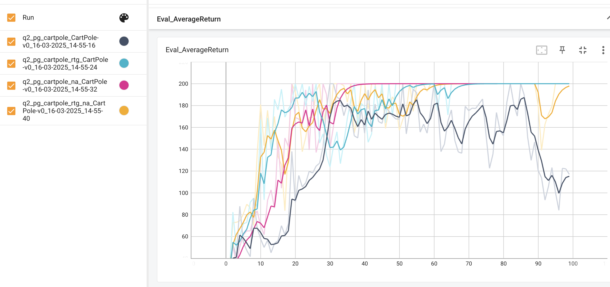
+ 大BatchSize下(average return vs. number of environment steps)的对比

问题回答
+ 在没有 advantage normalization的时候，the trajectorycentric one, or the one using reward-to-go哪一个好？

    reward-to-go 最后收敛到200
+ advantage normalization help?

    在trajectory centric one的时候，normalization在收敛速度和最终reward上都有帮助，无论batchsize小还是大
    在reward-to-go的时候，normalization可以帮助更快收敛。然而其在小batchsize的时候，后期会出现震荡。大batchsize的时候，则不会有这种现象。
+ batch size 对效果有影响吗？

    有影响。特别是在收敛速度和reward的稳定。其都有积极效应。

# Experiment 2( Using a Neural Network Baseline)
代码如下，baseline + 100 epoch达不到300 reward的效果。估计是因为版本不同的问题。
因此直接开大到200 epoch，轻松到达500的reward。
```bash
# No baseline
python cs285/scripts/run_hw2.py --env_name HalfCheetah-v4 \
-n 200 -b 5000 -rtg --discount 0.95 -lr 0.01 \
--exp_name cheetah
# Baseline
python cs285/scripts/run_hw2.py --env_name HalfCheetah-v4 \
-n 200 -b 5000 -rtg --discount 0.95 -lr 0.01 \
--use_baseline -blr 0.01 -bgs 5 --exp_name cheetah_baseline
```
+ 训练Loss曲线图
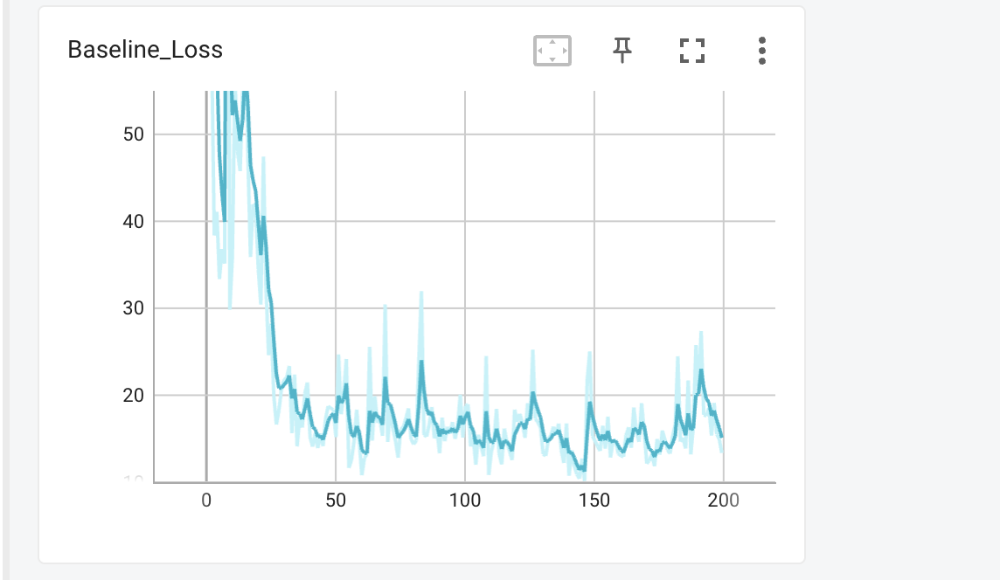
最后在15左右的loss震荡

+ Eval Return曲线图
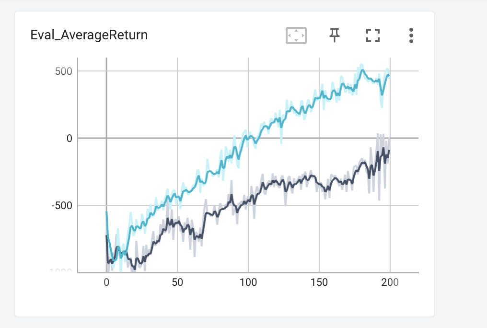

+ 调整baseline学习

    降低baseline gradient steps让baseline网络学习的更慢了.

+ 增加norm

    增加norm之后，reward到了800左右，比之前的500多很多。
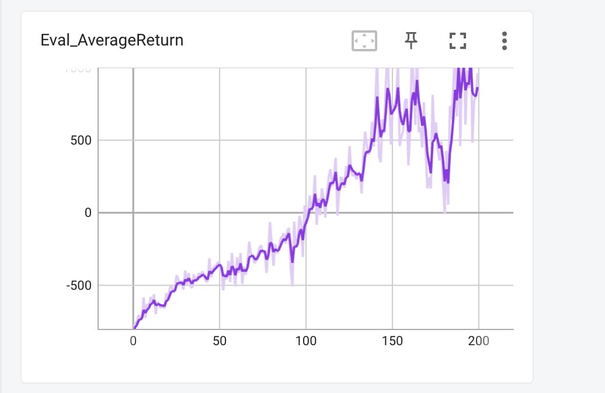
更值得说的是,baseline loss更大了。很奇怪哈。我的理解是polciy更新更加频繁，其policy的reward上涨的速度快，导致其value network的loss不停的涨。因为value network的预估出来的reward分布其实是过去的policy下的，而非现在的。
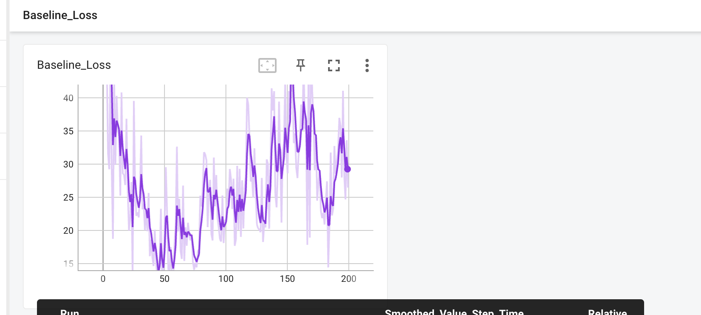

## Expriment 3 (LunarLander-v2)
使用默认配置的话，只变化$\lambda$的话，$\lambda = 0.99$的效果最好。最后差不多在160左右大幅度波动
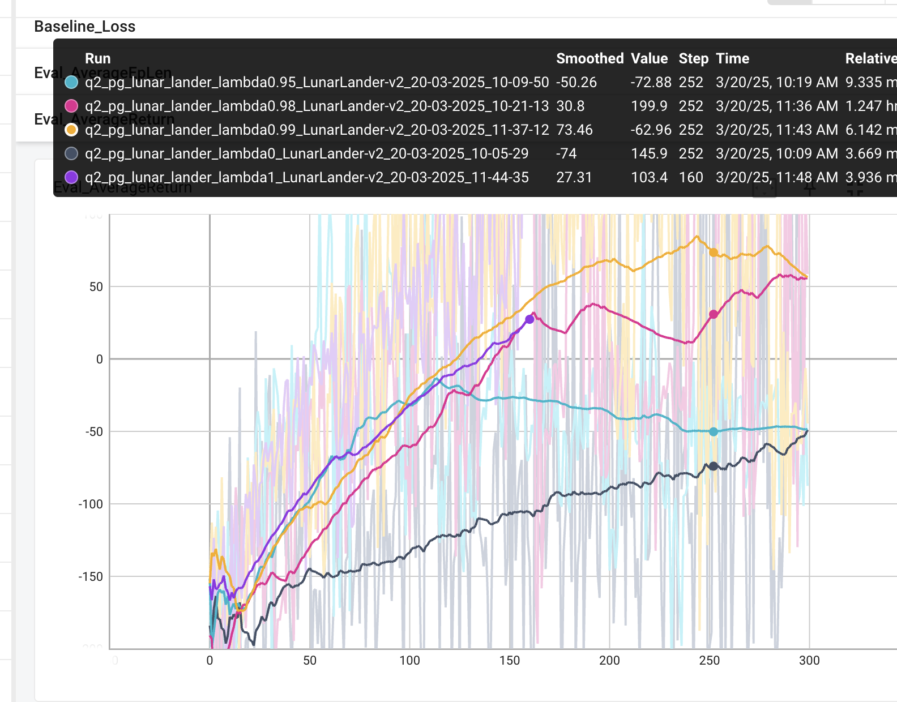

+ 当$\lambda = 0$的时候， 就是纯粹的TD，其估计出来的reward bias很大，虽然low variance，因此可以看到它学习的很慢。当$\lambda = 1$的时候，就是蒙塔卡洛-基线，虽然无bias，但是高方差。因此其学习的效果不是最好。$\lambda$为0.99的效果才是最好的，取得了一个比较好的trade-off


## Expriemnt 4 （Hyperparameters and Sample Efficiency）
默认配置下可以看到在80 step之后就接近了最优值，但是一直在震荡。由此可见policy的不稳定变化
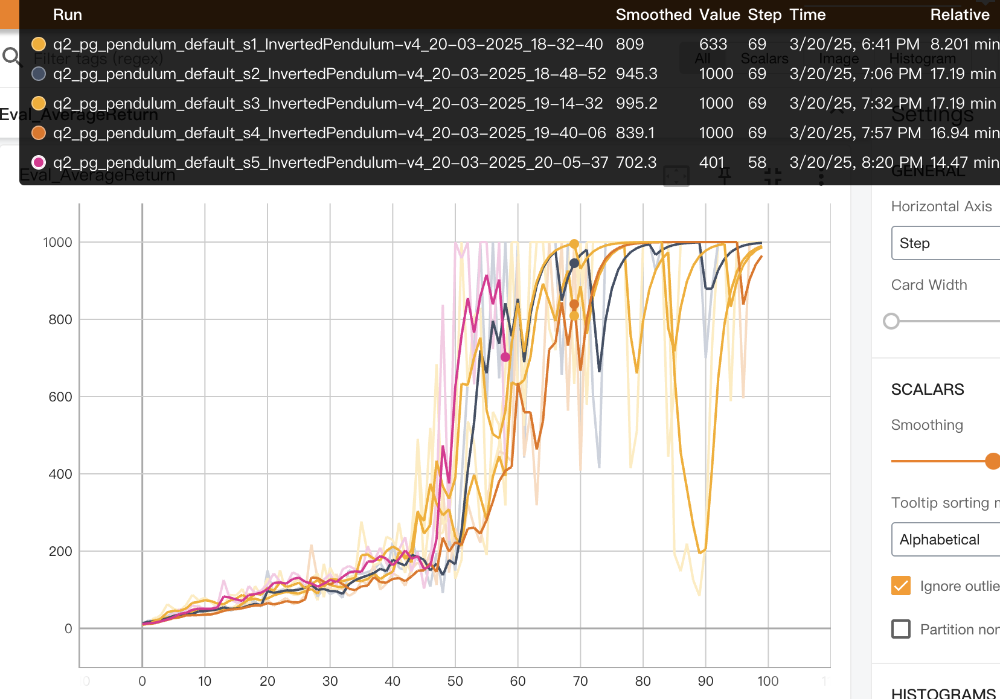
并且发现baseline loss一路直接起来，可以看到reward的方差大和policy的剧烈变化
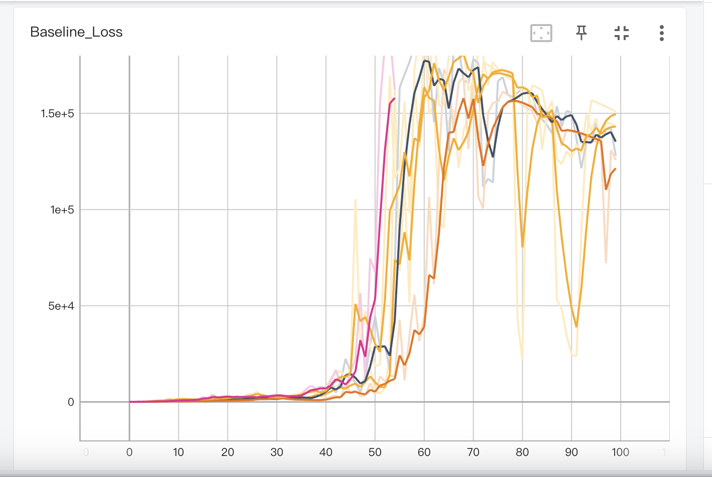
最后env step差不多有5e5

baseline loss变化剧烈，也许可以通过增加baseline network的更新次数/增加discount减少reward方差来提升baseline network的效果。
也可以通过增加layer size增加模型的拟合效果。

首先搜索出来一个比较好的discount，为0.98，可以看到其明显降低了baseline loss和reward的震荡幅度和收敛速度
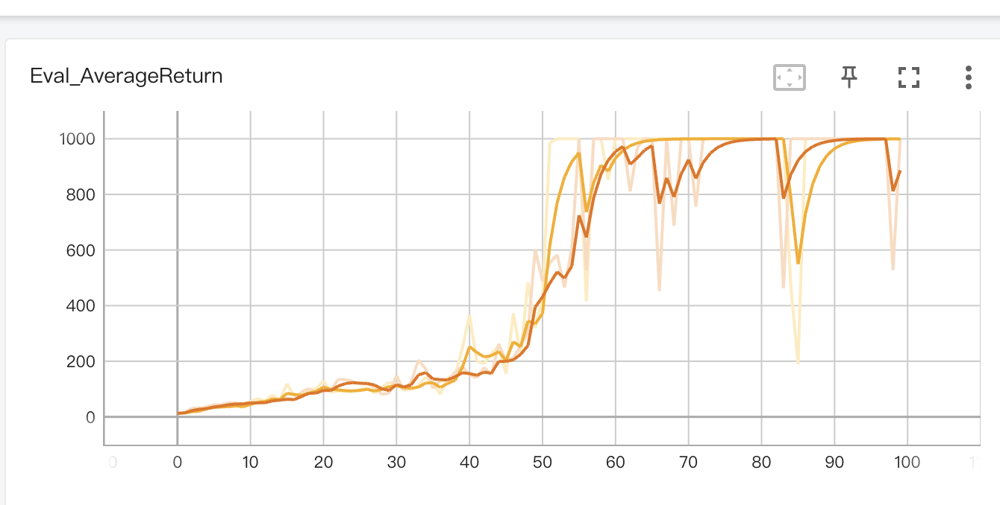
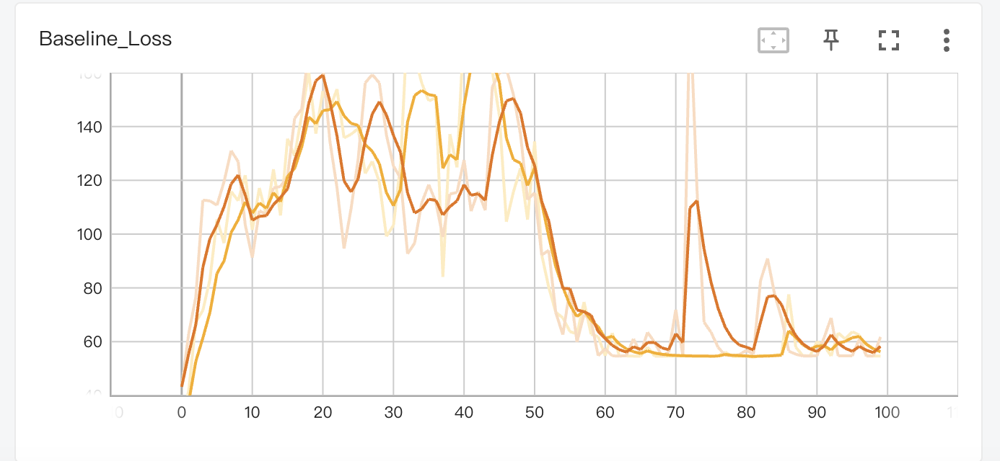
在优化完baseline网络的训练完之后，我们去优化reward的估计。
使用GAE estimation降低reward估计的方差。从结果看。没有明显改善。可能是因为这时候reward的unbias更加重要。
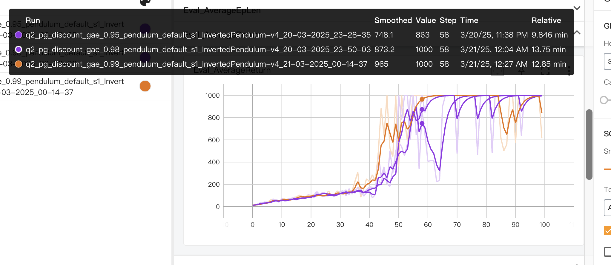
那么就转换思路，增强bias网络的容量。首先增加模型的layer数量，发现其确实能够到达高点，在40 step的时候，相比于之前5/60 step的时候。然而震荡幅度偏大
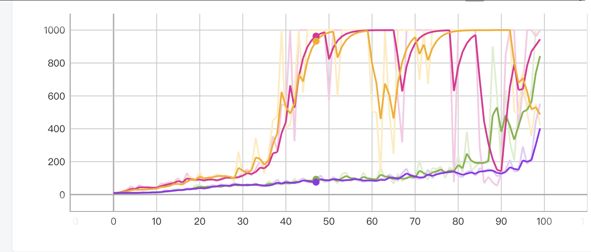
于是想着去更改学习率，因为发现其在后期的时候，reward会有一定的震荡，其代表了policy network的偶发性大幅度更新。
最后决定增大学习率为7e-3,对比为原先的5e-3。然后在训练到达40 step之后，再降低学习率。训练命令是
```bash
for layer in 3 4
do
    for seed in $(seq 1 1); do
        python cs285/scripts/run_hw2.py --env_name InvertedPendulum-v4 -n 100 \
        --exp_name udl_discount_layer_${layer}_pendulum_default_s$seed \
        -rtg --use_baseline -na \
        --batch_size 5000 \
        --discount 0.98 \
        -l $layer \
        -udl \
        -lr 7e-3 -blr 7e-3 \
        --seed $seed
    done
done
```
效果图如下
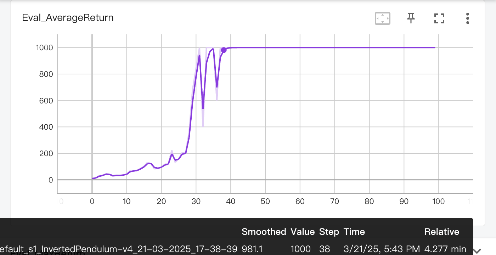

## Expriment 5(Humanoid-v4).
最后到1800 reward左右。从这个角度来看，RL的实现是很正确的,远超要求的600 reward。
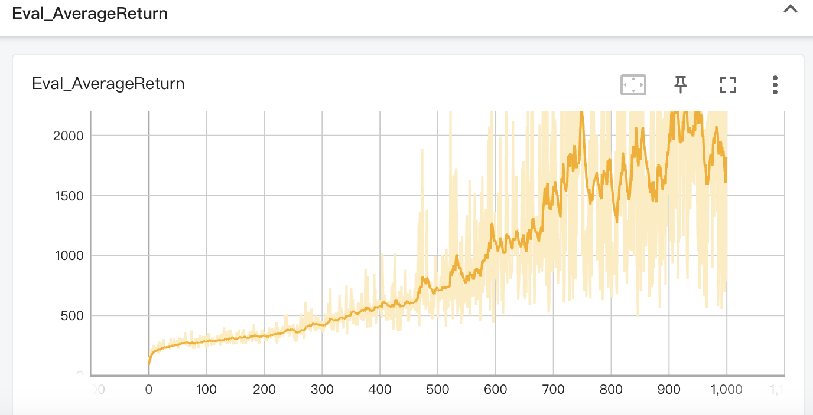

## Analysis
1. (a) 求解policy gradient解法下关于$\theta$的梯度。
求解如下
$$
\nabla J(\theta) = \mathbb E_{\tau \sim \pi_{\theta}}\nabla_\theta \log p(\tau) r(\tau)
$$
定义$\tau_k$ 为先执行$k$的$a_1$,再执行1次的$a_2$, 然后结束episode。其概率和reward分别为$\theta^k (1-\theta), k$。
因此
$$
\nabla J(\theta) = \sum_{k=1}^\infty p(\tau_k)\nabla \log p(\tau_k) r(\tau_k) \\
=\sum_{k=1}^\infty  \theta^k (1-\theta)\frac {k(1-\theta)-\theta}{\theta (1-\theta)} k \\
=(1-\theta)  \sum_{k=1}^\infty \theta^{k-1} k^2 -\theta \sum_{k=1}^\infty \theta^{k-1} k \\
=(1-\theta)\frac{1+\theta}{(1-\theta)^3} -\frac \theta  {(1-\theta)^2} \\
=\frac 1 {(1-\theta)^2}
$$
其中倒三等式化简倒二等式的时候用了两个经典的幂级数求和公式。
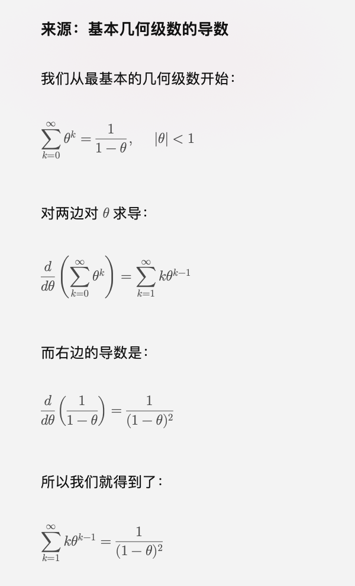
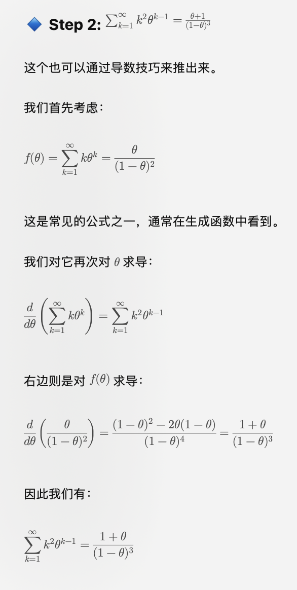

    (b) 求解先直接求reward，再求关于$\theta$的梯度。
    很明显，reward为
    $$
    J(\theta) = \theta \times 1 + (1-\theta) \times 0 + \theta \times (\theta \times 1 + (1-\theta) \times 0) + \theta^2 \times (\theta \times 1 + (1-\theta) \times 0) ... = \sum_{k=1}\theta^k =\frac \theta {1-\theta}
    $$
    表示了用户在第一个时刻的平均reward + 第二个时刻的平均reward + ...。其导数为$\frac 1 {(1-\theta)^2}$
    其策略梯度和(a)解法一致。
    还有一种利用迭代思路求$J(\theta)$, 就是
    $$
    J(\theta) = (1-\theta) \times 0 + \theta \times (J(\theta) + 1)=> J(\theta) = \frac \theta {1-\theta}
    $$

2. 计算policy gradient的方差。
policy gradient为
$$
\mathbb E[g^2] - \mathbb E[g]^2
$$
其中$E[g]^2$是已经知道的。求
$$
E[g^2] = \sum_{k=1}^{\infty} p(k)(k \times (\frac k \theta - \frac 1 {1-\theta}))^2 \\
$$
这里面要用到
$$
\sum_{k=1}^\infty k^3 \theta^{k-1}
= \frac{1}{\theta} \cdot \frac{\theta(\theta^2 + 4\theta + 1)}{(1 - \theta)^4}
= \frac{\theta^2 + 4\theta + 1}{(1 - \theta)^4} \\
\sum_{k=1}^\infty k^4 \theta^{k-1}
= \frac{1}{\theta} \cdot \frac{\theta(\theta^3 + 11\theta^2 + 11\theta + 1)}{(1 - \theta)^5}
= \frac{\theta^3 + 11\theta^2 + 11\theta + 1}{(1 - \theta)^5}
$$
使用以下python代数计算方程
```python
from sympy import *
x = Symbol('x', real=True)
k = Symbol('k', real=True)
one = 1 / (1-x) ** 2
two = (x + 1) / ((1-x)**3)
three = (x ** 2 + 4 * x + 1) / ((1-x) ** 4)
four = (x ** 3 + 11 * x ** 2 + 11 * x + 1 ) / ((1-x) ** 5)
print(one, two, three, four)

pg = four * (1-x) / x - 2 *  three  + two * x / (1-x) - 1 / (1-x) ** 4
pg_ans = cancel(pg)
print('pg_ans', simplify(pg_ans))
```
得到最后的方差为
$$
\frac {4\theta^2 + 8\theta + 1 } {\theta(1-\theta)^4}
$$
在$\theta=0,1$其方差最大为无穷。
在$\theta=0.1099$时方差最小，约为 27.9411。

3. return-to-go计算均值和方差

    当使用return-to-go的reward的时候，对每一个轨迹$\tau_k$, 其状态$s_{j}, j=0...k$下使用动作$a$后，其reward为$k-j$。因此其估计的梯度为
    $$
    \sum_{k=1}^{\infty}\theta^k(1-\theta)\frac 1 \theta (k+k-1+k-2...+0) =\sum_{k=1}^{\infty} \theta^{k-1}(1-\theta)\frac {k^2 +k}{2} \\
    =\frac 1 {(1-\theta)^2}
    $$
    其方差为
    $$
    \sum_{k=1}^{\infty} \theta^{k-1}((1-\theta)\frac {k^2 +k}{2})^2 - \frac 1 {(1-\theta)^4} \\
    = \frac {\theta ^ 2 + 3 \theta + 1} {\theta(1-\theta)^4}
    $$
    代码为
    ```python
    from sympy import *
    x = Symbol('x', real=True)
    k = Symbol('k', real=True)
    one = 1 / (1-x) ** 2
    two = (x + 1) / ((1-x)**3)
    three = (x ** 2 + 4 * x + 1) / ((1-x) ** 4)
    four = (x ** 3 + 11 * x ** 2 + 11 * x + 1 ) / ((1-x) ** 5)
    print(one, two, three, four)

    ans = (1-x) / (4 * x) * (four + 2 * three + two) - 1 / (1-x) ** 4
    print('ori ans', simplify(ans))
    ans = cancel(ans)
    print(simplify(ans))
    ```    
    观察reward-to-go reward和total reward梯度方差和theta的关系，可以看到使用reward-to-go其方差会大幅度减小
    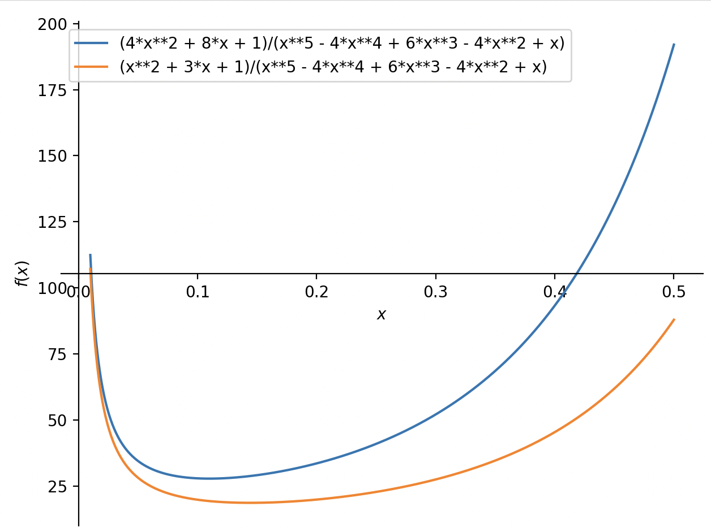
    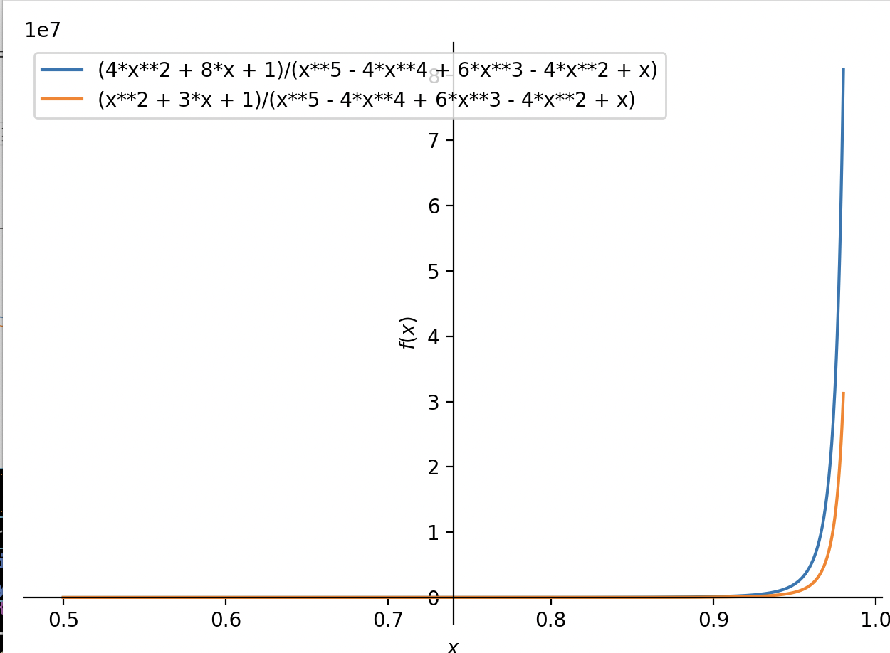

4. 计算importance sampling的梯度均值和方差

    首先很明显，只用agent到达$S_H$的时候才能获得奖励，其概率为$\theta'^{H-1}$。因此在Importance Sampling下，其梯度均值为
    $$
    \theta'^{H-1} \times \frac { \theta^{H-1}} { \theta'^{H-1}} \frac {H-1} {\theta} = \theta^{H-1}  \frac {H-1} {\theta}
    $$
    接下来，计算方差为
    $$
    \theta'^{H-1}  (\frac { \theta^{H-1}} { \theta'^{H-1}} \frac {H-1} {\theta})^2 - (\theta^{H-1}  \frac {H-1} {\theta}) ^ 2 \\= {(\frac {\theta^2} {\theta'})}^{H-1} (H-1)^2\frac {1- \theta^{(H-1)}} {\theta^2}
    $$
    可以看到当$H$无穷的时候,主导方程变化的是${(\frac {\theta^2} {\theta'})}^{H-1}$.
    当$\theta^2 < \theta'$,H无穷，方差趋向0。
    当$\theta^2 >= \theta'$,H无穷，方差趋向无穷。
    可是我们知道$\theta$越大，效果越好。这意味着当我们优化$\theta = \sqrt \theta'$的时候，我们的模型就会卡住，无法继续训练。这体现了importance sampling的缺点，使用off policy无法到达最优点，由于梯度方差的无穷。
