# Q-Learning
# 理论
### 1.1 TD-Learning Bias
No。因为$max$ 操作会有高估reward问题。
### 1.2 Tabular Learning 
1. 当N=1，并且是on policy的时候。I对。II错，因为batchsize要无限，才可以确保其到最优Q III对。根据贝尔曼压缩算子。
当N=1，并且是off policy的时候。I错，因为我们用的是offpolicy，行为策略不等价于目标策略。II错，因为fixed dataset和fixed batch size。III错，因为，我们用的是fixed batch size 无法获得最新的策略数据，无法继续迭代。
2. N > 1，on policy。 I对，II错。原因和之前一样。III对
N > 1, off policy。I错，分布不匹配。II 错。III错
3. N 等于无穷，on policy。I对。II错。III对。
N等于无穷，offpolicy。I错。II错。III错。
### 1.3 方差分析
+ highest方差: N无穷
+ lowest方差。N=1
### 1.4 Function Approximation
+ 2，3，4都对。如果是on policy。因为压缩算子的存在。
### 1.5 重要性采样
    当N=1的时候，不需要进行重要性采样。因为这时候没有涉及到动作的选择。
    当N>1的时候，就需要进行重要性采样。根据动作概率来进行。具体公式略过

# 代码
+ CartPole-v1实验
    首先可以看到reward基本达标，靠近500。然后小学习率和大学习率的对比，可以看到在大学习率0.05下critic loss学习的很震荡，即使q value预估值和小学习率差不多。这从侧面反映了如果critic学的不好，Value函数建模不好，就会导致策略选择的不好。
    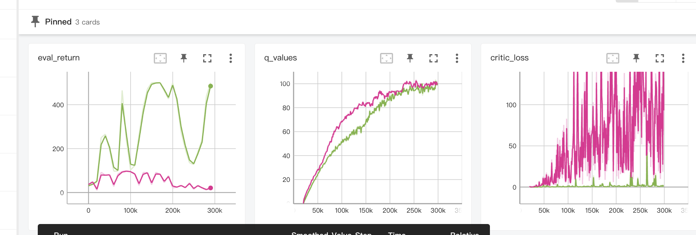
+ lunarlander实验
    double Q和平凡Q Lerning的对比。可以看到只有在后期的时候double Q会超越平凡Q Lerning。这感觉是因为的高估reward影响不大，后期影响大。
    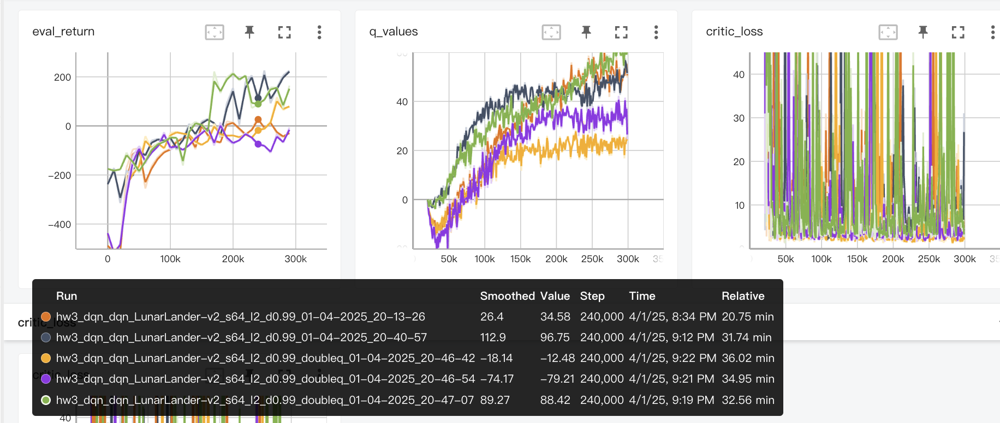
+  MsPacman-v0 实验
    效果复合预期。最后的reward到了1800左右。并且可以看到在训练和infer的早期阶段。在100k～200k的时候，训练的reward小于infer。推测因为训练的时候数据是使用epsilon来采样的，而infer的时候使用的是greedy采样。
    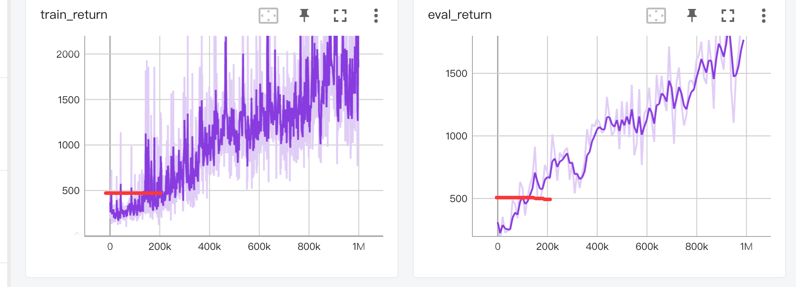
+ Hyperparameters调整
    在Cartpole上进行实验。使用Double DQN + 不同的Num Lyaer(2,3,4)进行实验。实验效果看上去对layers不敏感，并且double Q-Learning没啥效果。
    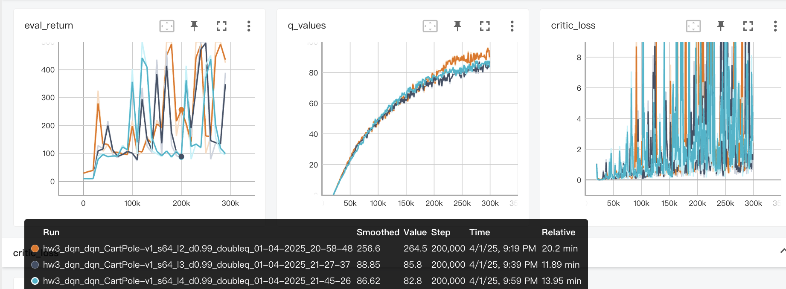
    增强训练step从300k到1M，效果没什么变化
    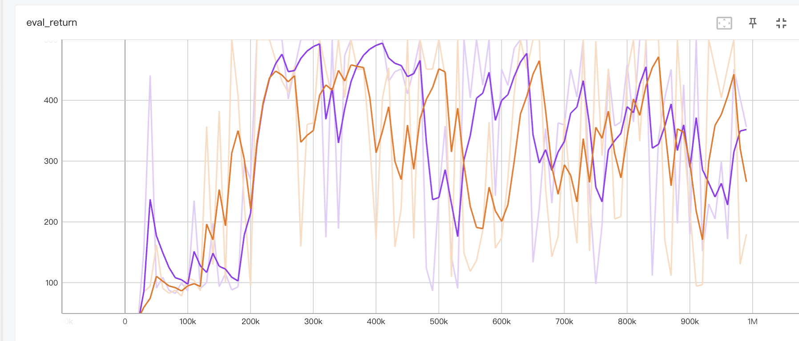
    看上去是lr导致的。应该使用动态的LR。于是每隔给定的M step将学习率缩小为原先的1/10。这种情况下Double
    Q Learning会比基本的Q Lerning好很多
    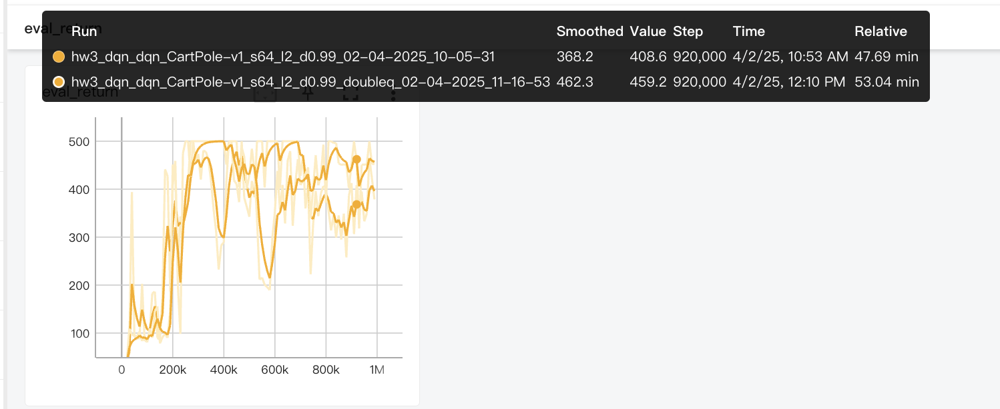
#  SAC连续动作
+ Pendulum-v1实验
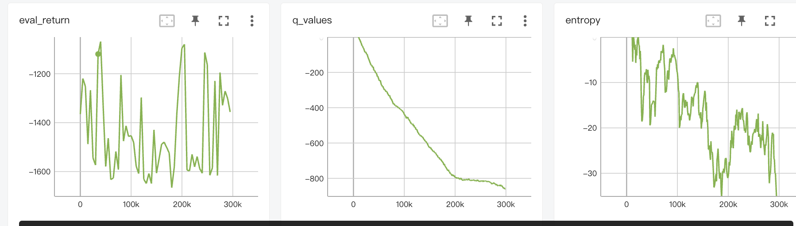
reward和Entropy复合预期。Entropy一开始的时候在0.66左右。
+ InvertedPendulum-v4实验
reward能够到达1000，但是比较震荡
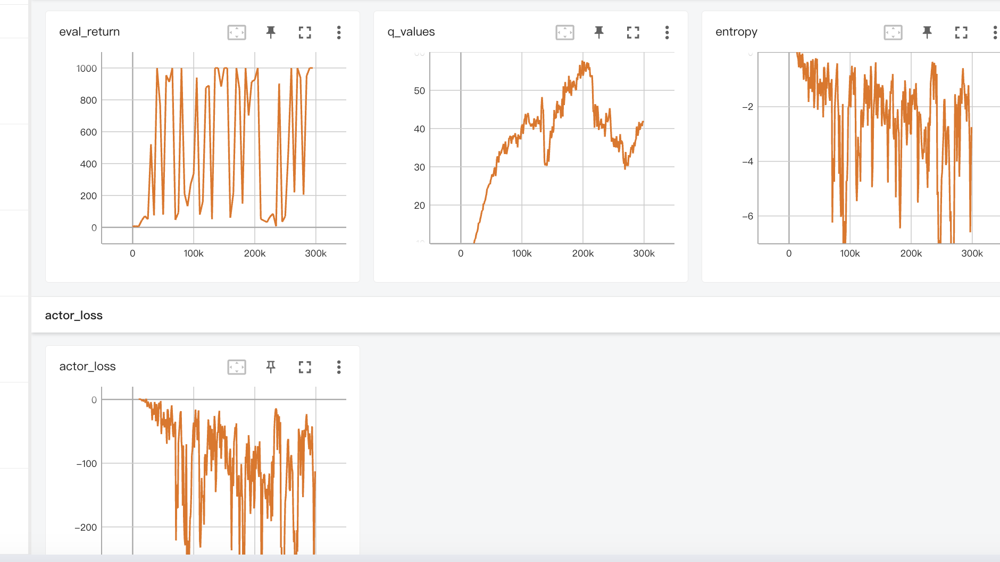
发现使用REPARAMETRIZE之后，其效果会好非常多。效果非常稳定，虽然最后突然跌了下去。不过估计只要控制一下LR就好
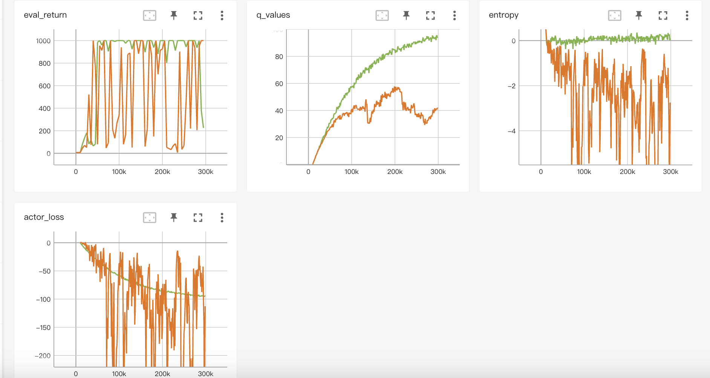
+ HalfCheetah-v4实验
可以看到REPARAMETRIZE的Actor吊打REFINFORCE。感觉效果来自于critic网络预估的Q函数可以直接求导回去。而且可以发现其效果很稳定，侧面反映了梯度的低方差。
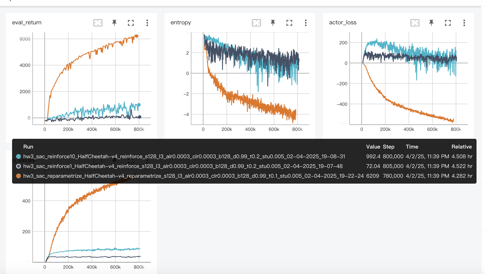
+ Hopper实验
感觉这个实验有点意思，eval_retrun是clipq最好。但是q value是double q最好。想一想 符合预期。因为Q value是自己预估的，并且double q 的mean值天然会大于等于min q =》最后迭代训练出来的CLIP Q网络的均值也会比较小。
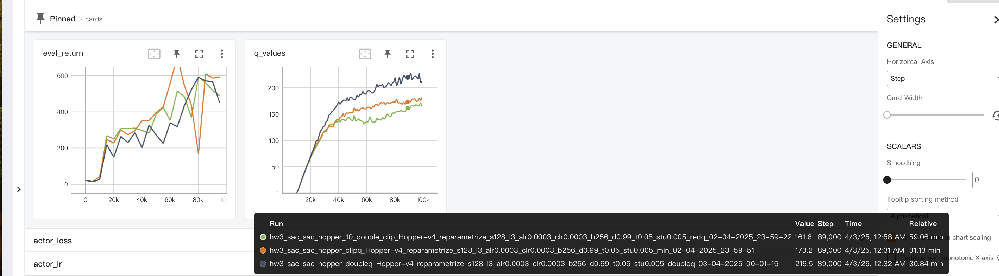
+ Humanoid-v4实验
从样本效率来看，offline没有online好。online在1000 step的时候就可以到达1800 reward。但是从最后的结果来看，offline确实优秀，最后reward非常高，到了5000。
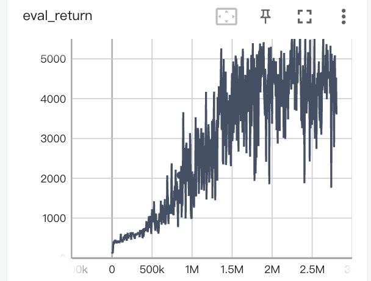