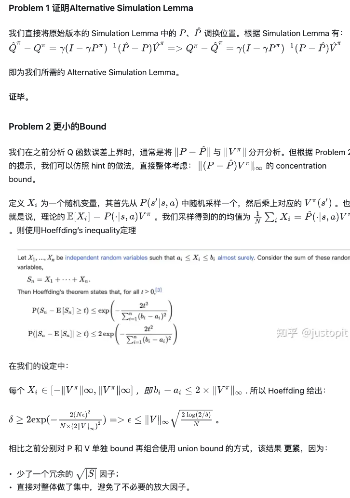
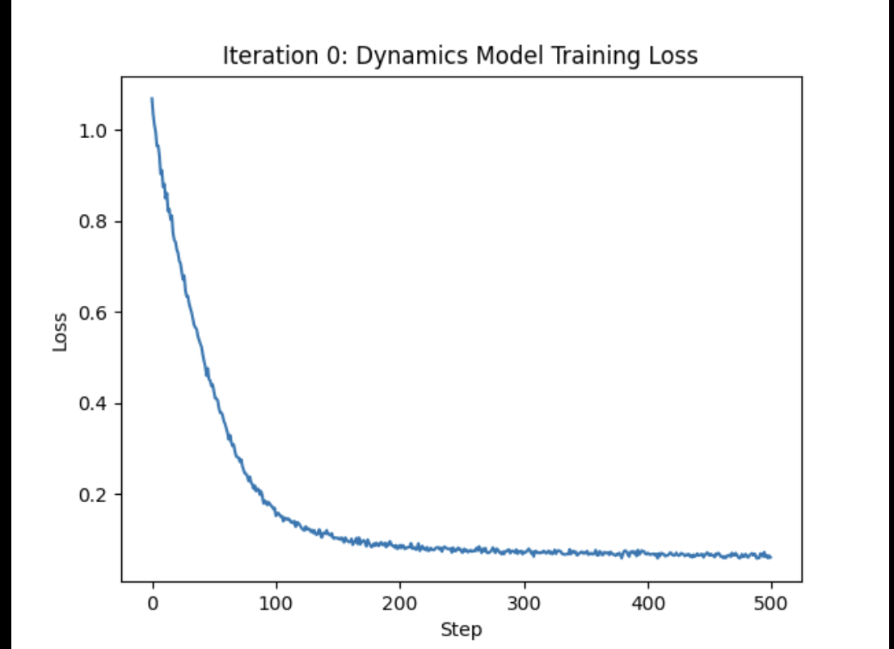
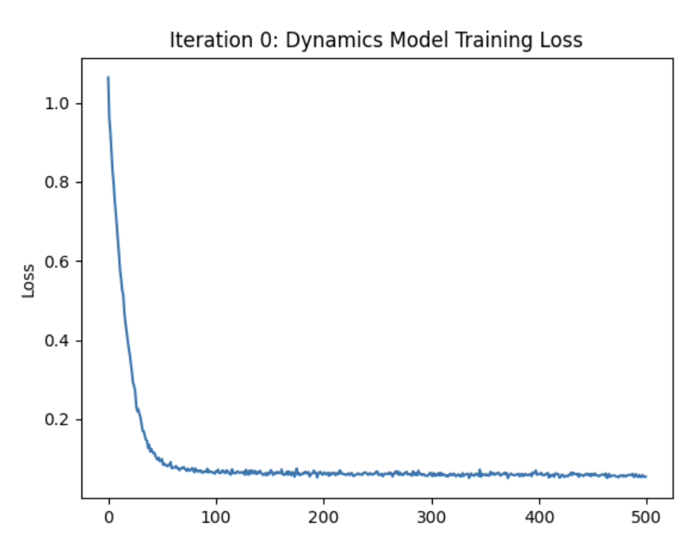
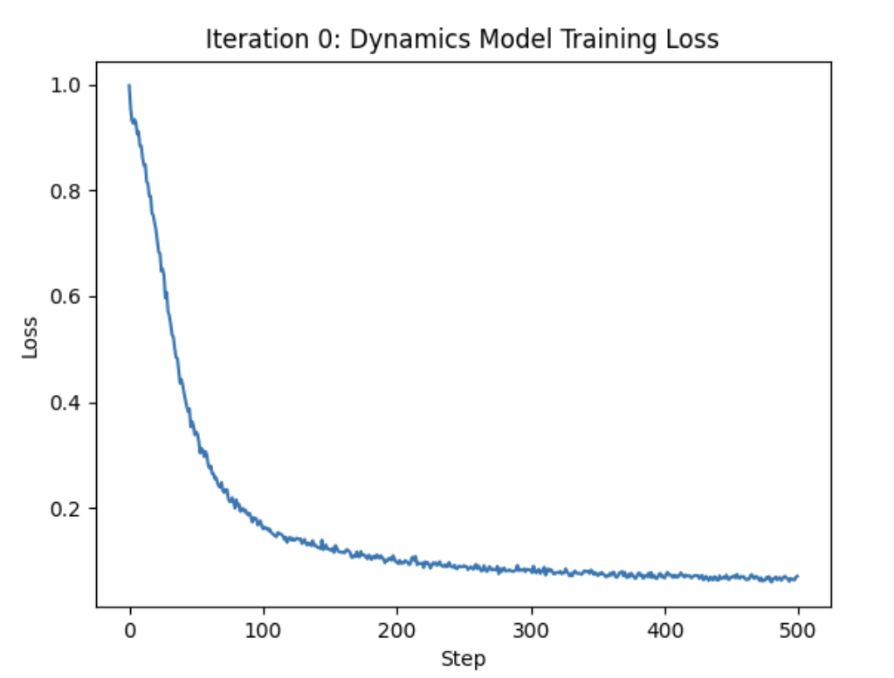
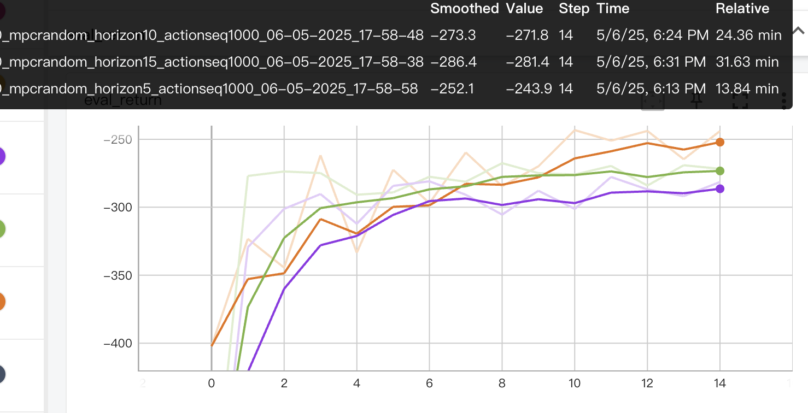
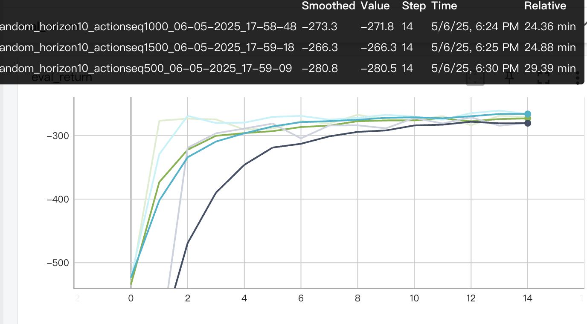
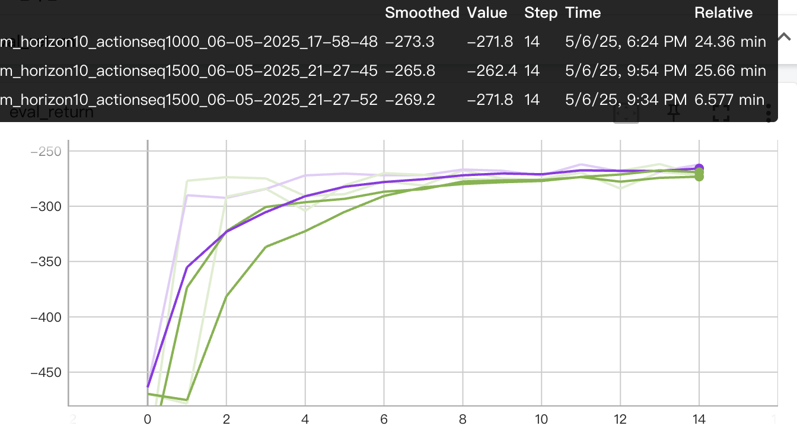
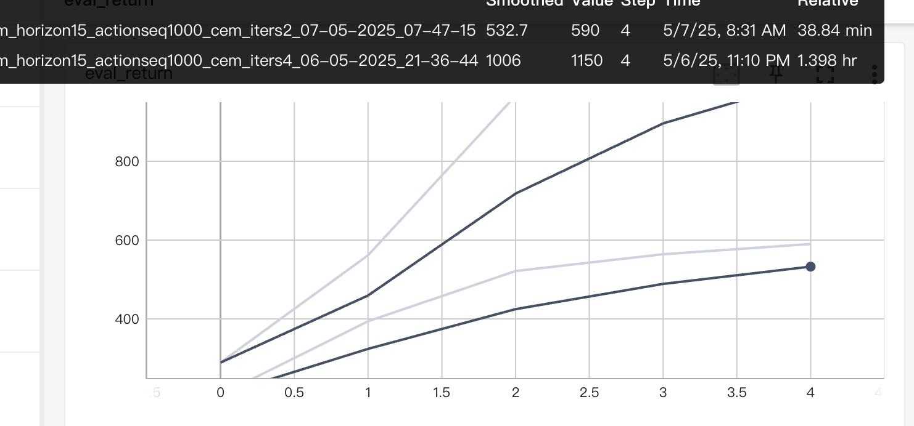

# 分析题

因此在问题2中，1错，其他都对

# 编程题
## Problem 1 dynamics model学习
对比来看，最后还是layer3 h32比较好
+ layer 1 h32

+ layer1 h128

+ layer3 h32

## Problem 2 评估rollouts
最后的Average eval return是: -35.5，符合预期，小于-70

## Problem 3  不同环境下的reward
+ cheetah 380 reward
+ obstacles -38 reward
+ reacher -274 reward
基本都符合预期，说明代码基本正确

## Problem 4 不同参数下的reward
+ horizon越小越好

+ Action Sequence越多越好，但是ROI比较低

+ EMB size对return影响不大

## Problem 5 CEM
迭代4次会比迭代2次好很多

## Problem 6 MBPO
加数据和不加数据差别很大。最后reward超过800符合预期

